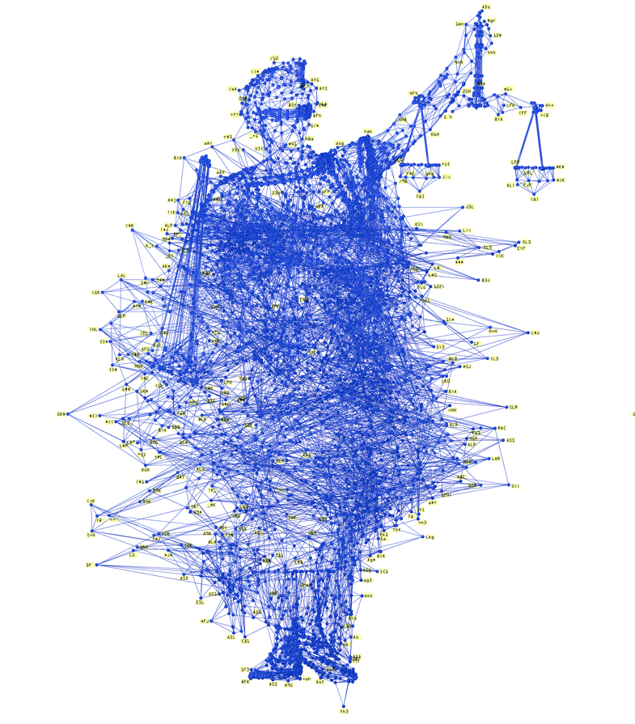

# Legal Analytics  

## Can we ever hope to predict Supreme Court decisions before they happen?

 
#### Supporting Materials 

- [A general approach for predicting the behavior of the Supreme Court of the United States](https://www.ncbi.nlm.nih.gov/pmc/articles/PMC5389610/)

- [AI predicts outcomes of human rights trials](https://www.ucl.ac.uk/news/2016/oct/ai-predicts-outcomes-human-rights-trials)

- [Assessing and Predicting Who Wins Federal Tax Trial Decisions](https://papers.ssrn.com/sol3/papers.cfm?abstract_id=320887)

- [Artificial intelligence prevails at predicting Supreme Court decisions](https://www.sciencemag.org/news/2017/05/artificial-intelligence-prevails-predicting-supreme-court-decisions)

- [Competing Approaches to Predicting Supreme Court Decision Making](https://www.researchgate.net/publication/228498747_Competing_Approaches_to_Predicting_Supreme_Court_Decision_Making)

- [Commentary: Factors predicting family court decisions in high-conflict divorce](https://europepmc.org/abstract/med/23771935)

- [How to Forecast Constitutional Court Decisions? Legal Context and Political Context in a Machine Learning Framework](https://sebastiansternberg.github.io/pdf/forecasting_gfcc_sternberg.pdf)

- [Human Decisions and Machine Predictions](https://www.ncbi.nlm.nih.gov/pmc/articles/PMC5947971/)

- [Judicial Prediction and Analysis From Empirical Probability Tables](https://www.repository.law.indiana.edu/cgi/viewcontent.cgi?article=3635&context=ilj)

- [Machine learning increases algorithm success rate that predicts decisions of the US Supreme Court](https://www.sciencemag.org/news/2017/05/artificial-intelligence-prevails-predicting-supreme-court-decisions)

- [Machine Learning In The Judicial System Is Mostly Just Hype](https://palladiummag.com/2019/03/29/machine-learning-in-the-judicial-system-is-mostly-just-hype/)

- [Machine Learning, Text Data, and Supreme Court Forecasting](http://www.aaronrkaufman.com/wp-content/uploads/2016/06/Supreme_Court_Prediction_v17.pdf)

- [Moneyball Meets the Supreme Court](https://www.lexpredict.com/portfolio/predicting-the-supreme-court/)

- [Predicting Decisions of the Philippine Supreme Court Using Natural Language Processing and Machine Learning](https://ieeexplore.ieee.org/document/8377844)

- [Predicting Deference in Appellate Court Decisions](https://scholar.princeton.edu/sites/default/files/amysemet/files/semet_deference.pdf)

- [Predicting justice: what if algorithms entered the courthouse?](http://theconversation.com/predicting-justice-what-if-algorithms-entered-the-courthouse-91692)

- [Predicting Judicial Decisions of Criminal Cases from Thai Supreme Court Using Bi-directional GRU with Attention Mechanism](https://ieeexplore.ieee.org/document/8592948)

- [Predicting judicial decisions of the European Court of Human Rights: a Natural Language Processing perspective](https://peerj.com/articles/cs-93/)

- [Predicting the Outcome of Appeal Decisions in Germany's Tax Law](https://hal.inria.fr/IFIP-LNCS-10429/hal-017033260)

- [Predicting Supreme Court Decisions Mathematically: A Quantitative Analysis of the "Right to Counsel" Cases](https://www.jstor.org/stable/1951767?seq=1#page_scan_tab_contents)

- [Predicting future Supreme Court decisions on race and the Fourth Amendment](https://search.proquest.com/openview/f42dcc70ab72faec838aa20ffc56e67f/1?pq-origsite=gscholar&cbl=29246)

- [Predicting the Outcome of Appeal Decisions in Germany’s Tax Law](https://wwwmatthes.in.tum.de/pages/1frgc0kwmx77q/Predicting-the-Outcome-of-Appeal-Decisions-in-Germany-s-Tax-Law)

- [Recent Rulings Show How Hard It Is to Predict High-Profile Court Decisions](https://www.npr.org/sections/itsallpolitics/2012/06/28/155925331/recent-rulings-show-how-hard-it-is-to-predict-high-profile-court-decisions)

- [The Supreme Court Forecasting Project: Legal and Political Science Approaches to Predicting Supreme Court Decisionmaking](https://www.jstor.org/stable/4099370?seq=1#page_scan_tab_contents)

- [Using Simple Calculations to Predict Judicial Decisions](https://journals.sagepub.com/doi/abs/10.1177/000276426000400409?journalCode=absb)

- [Wisdom of the Crowd Accurately Predicts Supreme Court Decisions](https://www.technologyreview.com/s/609852/wisdom-of-the-crowd-accurately-predicts-supreme-court-decisions/)

- [Why The Best Supreme Court Predictor In The World Is Some Random Guy In Queens](https://fivethirtyeight.com/features/why-the-best-supreme-court-predictor-in-the-world-is-some-random-guy-in-queens/)
